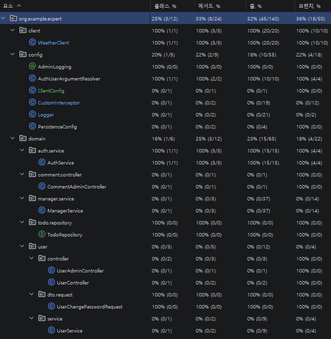

# 🚀 Spring Expert 과제 - 코드 리팩토링 및 기능 개선

[](https://openjdk.java.net/)
[](https://spring.io/projects/spring-boot)
[](https://spring.io/projects/spring-data-jpa)
[](https://docs.spring.io/spring-framework/reference/core/aop.html)

---

## 📖 프로젝트 소개

이 프로젝트는 **Spring Boot 3.x** 기반의 일정 관리(Todo) 애플리케이션으로, 다양한 문제점들을 식별하고 개선하는 과제입니다.

### 🎯 과제 목표
* ArgumentResolver, Service 로직, API 클라이언트의 **구조적 문제 파악 및 개선**
* **N+1 문제 해결**을 통한 쿼리 성능 최적화
* **유효성 검증 로직**의 적절한 계층 분리
* **Interceptor와 AOP**를 활용한 관리자 API 로깅 시스템 구축
* **테스트 코드 개선**을 통한 안정성 확보
* **IoC/DI 원칙**을 준수한 코드 구조 개선

---

## 🛠️ 기술 스택

| 구분 | 기술 | 설명 |
|:---:|:---:|:---|
| **Language** | Java 17 | LTS 버전, Record 타입 지원 |
| **Framework** | Spring Boot 3.x | Jakarta EE 9+ 기반 |
| **ORM** | Spring Data JPA | N+1 문제 해결, @EntityGraph 활용 |
| **AOP** | Spring AOP | @Around를 활용한 로깅 시스템 |
| **Validation** | Jakarta Validation | DTO 레벨 검증 (@Pattern, @Size) |
| **Auth** | JWT | 토큰 기반 인증 시스템 |
| **HTTP Client** | RestTemplate | 외부 API 호출 (날씨 정보) |

---

## 📋 과제 요구사항별 해결 내용

### 1️⃣ AuthUserArgumentResolver 동작 활성화

#### 🔍 문제 상황
`AuthUserArgumentResolver`가 구현되어 있지만 Spring MVC에 등록되지 않아 동작하지 않는 상황

#### ✅ 해결 방법
**PersistenceConfig**에 `WebMvcConfigurer`를 구현하여 ArgumentResolver를 등록했습니다.

```java
@Configuration
@RequiredArgsConstructor
@EnableJpaAuditing
public class PersistenceConfig implements WebMvcConfigurer {

    private final AuthUserArgumentResolver authUserArgumentResolver;

    @Override
    public void addArgumentResolvers(List<HandlerMethodArgumentResolver> resolvers) {
        resolvers.add(authUserArgumentResolver);
    }
}
```

#### 💡 기술적 의사결정
* `@Component`로 등록된 ArgumentResolver는 **자동으로 등록되지 않습니다**
* 반드시 `WebMvcConfigurer.addArgumentResolvers()`를 통해 **명시적으로 등록**해야 합니다

---

### 2️⃣ AuthService - 불필요한 passwordEncoder 호출 방지

#### 🔍 문제 상황
회원가입 시 이메일 중복 체크 **이전에** 비밀번호 암호화가 실행되어, 중복 이메일일 경우에도 불필요한 암호화 연산이 발생

#### ✅ 해결 방법
**이메일 중복 체크를 passwordEncoder 호출 전**으로 이동했습니다.

**개선 전:**
```java
String encodedPassword = passwordEncoder.encode(signupRequest.getPassword());

if (userRepository.existsByEmail(signupRequest.getEmail())) {
    throw new InvalidRequestException("이미 존재하는 이메일입니다.");
}
```

**개선 후:**
```java
// 1. 먼저 중복 체크
if (userRepository.existsByEmail(signupRequest.getEmail())) {
    throw new InvalidRequestException("이미 존재하는 이메일입니다.");
}

// 2. 검증 통과 후 암호화 수행
String encodedPassword = passwordEncoder.encode(signupRequest.getPassword());
```

#### 💡 성능 개선 효과
| 항목 | 개선 전 | 개선 후 |
|:---:|:---:|:---:|
| 중복 이메일 실패 시 | DB 조회 + **암호화 연산** | DB 조회만 수행 |

실패가 확정된 요청에서는 암호화를 수행하지 않는 것이 효율적입니다.

---

### 3️⃣ WeatherClient - 응답 검증 순서 개선

#### 🔍 문제 상황
HTTP 응답 body를 먼저 확인한 후 상태 코드를 체크하여, **논리적 순서가 뒤바뀐 상황**

#### ✅ 해결 방법
**상태 코드 검증 → body null 체크** 순서로 변경했습니다.

**개선 전:**
```java
WeatherDto[] weatherArray = responseEntity.getBody(); // body 먼저 확인
if (!HttpStatus.OK.equals(responseEntity.getStatusCode())) {
    throw new ServerException("날씨 데이터를 가져오는데 실패했습니다.");
}
```

**개선 후:**
```java
// 1. 먼저 HTTP 상태 코드 확인
if (!HttpStatus.OK.equals(responseEntity.getStatusCode())) {
    throw new ServerException("날씨 데이터를 가져오는데 실패했습니다. 상태 코드: " 
        + responseEntity.getStatusCode());
}

// 2. 상태 코드가 정상이면 body 확인
WeatherDto[] weatherArray = responseEntity.getBody();
if (weatherArray == null || weatherArray.length == 0) {
    throw new ServerException("날씨 데이터가 없습니다.");
}
```

#### 💡 개선 효과
* **에러 원인 파악이 명확**: 상태 코드 에러와 데이터 부재 에러를 구분
* **논리적 흐름 개선**: HTTP 통신 실패 → 응답 데이터 검증 순서로 자연스럽게 처리

---

### 4️⃣ UserService - 비밀번호 검증을 DTO로 이동

#### 🔍 문제 상황
Service 계층에서 비밀번호 형식 검증을 수행하여 **책임 분리 원칙 위배**

#### ✅ 해결 방법
**비밀번호 검증 로직을 DTO의 Jakarta Validation으로 이동**했습니다.

**개선 전 (UserService):**
```java
if (userChangePasswordRequest.getNewPassword().length() < 8 ||
        !userChangePasswordRequest.getNewPassword().matches(".*\\d.*") ||
        !userChangePasswordRequest.getNewPassword().matches(".*[A-Z].*")) {
    throw new InvalidRequestException("새 비밀번호는 8자 이상이어야 하고, 숫자와 대문자를 포함해야 합니다.");
}
```

**개선 후 (UserChangePasswordRequest DTO):**
```java
@NotBlank
@Size(min = 8, message = "새 비밀번호는 8자 이상이어야 합니다.")
@Pattern(regexp = "^(?=.*\\d)(?=.*[A-Z]).+$",
        message = "새 비밀번호는 숫자와 대문자를 포함해야 합니다.")
private String newPassword;
```

#### 💡 개선 효과

| 구분 | 개선 전 | 개선 후 |
|:---:|:---:|:---:|
| **검증 시점** | Service 계층 | Controller 진입 전 (DTO) |
| **책임 분리** | Service가 검증 담당 | DTO가 자기 검증 |
| **재사용성** | Service에 종속 | 어디서든 DTO만으로 검증 가능 |
| **에러 응답** | 수동 예외 처리 | `@Valid`로 자동 처리 |

---

### 5️⃣ TodoRepository - N+1 문제 해결 (@EntityGraph 적용)

#### 🔍 문제 상황
Todo 목록 조회 시 각 Todo마다 연관된 User를 개별 조회하여 **N+1 쿼리 발생**

#### ✅ 해결 방법
**JPQL fetch join을 @EntityGraph로 변경**하여 동일한 성능 최적화를 더 간결하게 구현했습니다.

**개선 전 (JPQL):**
```java
@Query("SELECT t FROM Todo t LEFT JOIN FETCH t.user ORDER BY t.modifiedAt DESC")
Page<Todo> findAllByOrderByModifiedAtDesc(Pageable pageable);
```

**개선 후 (@EntityGraph):**
```java
@EntityGraph(attributePaths = {"user"})
Page<Todo> findAllByOrderByModifiedAtDesc(Pageable pageable);
```

#### 💡 성능 비교

**개선 전 (N+1 발생):**
```sql
SELECT * FROM todo;                    -- 1번 쿼리
SELECT * FROM user WHERE id = 1;       -- N번 쿼리
SELECT * FROM user WHERE id = 2;
SELECT * FROM user WHERE id = 3;
...
```

**개선 후 (JOIN 1번):**
```sql
SELECT t.*, u.* 
FROM todo t 
LEFT JOIN user u ON t.user_id = u.id
ORDER BY t.modified_at DESC;           -- 단 1번의 쿼리
```

#### 🎯 @EntityGraph vs JPQL Fetch Join 비교

| 구분 | @EntityGraph | JPQL Fetch Join |
|:---:|:------------:|:---------------:|
| **코드 간결성** |    매우 간결     |   JPQL 작성 필요    |
| **성능** |      동일      |       동일        |
| **가독성** |    명확한 의도    |   JPQL 이해 필요    |

---

### 6️⃣ Interceptor와 AOP를 활용한 Admin API 로깅

#### 🔍 요구사항
관리자 전용 API에 접근할 때마다 **요청 정보를 로깅**하고, **권한 없는 사용자의 접근을 차단**해야 합니다.

#### ✅ 구현 방법: Interceptor + AOP 조합

---

#### **Interceptor - 권한 검증 및 접근 로깅**

`CustomInterceptor`를 구현하여 **Admin API 접근 전에 권한을 검증**하고 로그를 기록합니다.

```java
@Slf4j
@Component
public class CustomInterceptor implements HandlerInterceptor {

    @Override
    public boolean preHandle(HttpServletRequest request, HttpServletResponse response, 
                            Object handler) throws Exception {
        String method = request.getMethod();
        String path = request.getRequestURI();

        // Admin API만 체크 (DELETE /admin/comments/*, PATCH /admin/users/*)
        boolean isAdminApi = (method.equals("DELETE") && path.matches("/admin/comments/\\d+")) ||
                            (method.equals("PATCH") && path.matches("/admin/users/\\d+"));

        if (!isAdminApi) {
            return true; // Admin API가 아니면 통과
        }

        // 권한 검증
        String userRole = (String) request.getAttribute("userRole");
        if (userRole == null) {
            response.sendError(HttpServletResponse.SC_FORBIDDEN, "접근 권한이 없습니다.");
            return false;
        }

        UserRole role = UserRole.of(userRole);
        if (!UserRole.ADMIN.equals(role)) {
            response.sendError(HttpServletResponse.SC_FORBIDDEN, "접근 권한이 없습니다.");
            return false;
        }

        // 접근 로그 기록
        Long userId = (Long) request.getAttribute("userId");
        log.info("[관리자 기능 접근] userId = {}, requestTime = {}, url = {}",
                userId, LocalDateTime.now(), path);

        return true;
    }
}
```

**Interceptor 등록:**
```java
@Override
public void addInterceptors(InterceptorRegistry registry) {
    registry.addInterceptor(customInterceptor)
            .addPathPatterns("/admin/comments/*")
            .addPathPatterns("/admin/users/*");
}
```

---

#### **AOP - 상세 요청/응답 로깅**

`@AdminLogging` 커스텀 어노테이션과 AOP를 활용하여 **요청 본문과 응답 본문을 JSON으로 로깅**합니다.

**1. 커스텀 어노테이션 정의:**
```java
@Target(ElementType.METHOD)
@Retention(RetentionPolicy.RUNTIME)
public @interface AdminLogging {
}
```

**2. AOP Aspect 구현:**
```java
@Aspect
@Component
@Slf4j
public class Logger {

    private final ObjectMapper mapper = new ObjectMapper();

    @Around("@annotation(org.example.expert.config.AdminLogging)")
    public Object executionLogger(ProceedingJoinPoint joinPoint) throws Throwable {
        
        // 요청 정보 수집
        MethodSignature signature = (MethodSignature) joinPoint.getSignature();
        String className = joinPoint.getTarget().getClass().getSimpleName();
        String methodName = joinPoint.getSignature().getName();
        
        // 파라미터 추출
        String[] parameterNames = signature.getParameterNames();
        Object[] args = joinPoint.getArgs();
        Map<String, Object> paramsMap = new LinkedHashMap<>();
        for (int i = 0; i < parameterNames.length; i++) {
            paramsMap.put(parameterNames[i], args[i]);
        }

        // HTTP 요청 정보
        HttpServletRequest request = ((ServletRequestAttributes)
                RequestContextHolder.getRequestAttributes()).getRequest();
        Long userId = (Long) request.getAttribute("userId");
        String url = request.getRequestURI();

        String paramsJson = mapper.writeValueAsString(paramsMap);

        // 요청 로그
        log.info("[API 요청] userId = {}, url = {}, {}.{} | 요청: [{}]",
                userId, url, className, methodName, paramsJson);

        long start = System.currentTimeMillis();
        
        // 실제 메서드 실행
        Object proceed = joinPoint.proceed();
        
        long end = System.currentTimeMillis();
        String responseJson = mapper.writeValueAsString(proceed);

        // 응답 로그
        log.info("[API 응답] userId = {}, {}.{} | 응답: {} (수행시간: {}ms)",
                userId, className, methodName, responseJson, (end - start));

        return proceed;
    }
}
```

**3. Controller에 어노테이션 적용:**
```java
@RestController
@RequiredArgsConstructor
public class CommentAdminController {

    @AdminLogging
    @DeleteMapping("/admin/comments/{commentId}")
    public void deleteComment(@PathVariable long commentId) {
        commentAdminService.deleteComment(commentId);
    }
}
```

```java
@RestController
@RequiredArgsConstructor
public class UserAdminController {

    @AdminLogging
    @PatchMapping("/admin/users/{userId}")
    public void changeUserRole(@PathVariable long userId, 
                              @RequestBody UserRoleChangeRequest request) {
        userAdminService.changeUserRole(userId, request);
    }
}
```

---

#### 💡 Interceptor vs AOP 역할 분담

| 구분 |     Interceptor     |         AOP         |
|:---:|:-------------------:|:-------------------:|
| **목적** |    권한 검증 및 접근 차단    |      상세 로그 기록       |
| **처리 시점** | Controller 진입 **전** |    메서드 실행 **전후**    |
| **로깅 내용** | userId, 요청 시각, URL  | 요청 본문, 응답 본문, 수행 시간 |
| **실행 순서** |        먼저 실행        |     권한 통과 후 실행      |

---

#### 📊 로그 출력 예시

**Interceptor 로그 (권한 검증):**
```
[관리자 기능 접근] userId = 1, requestTime = 2026-03-06T10:30:00, url = /admin/comments/123
```

**AOP 로그 (상세 요청/응답):**
```
[API 요청] userId = 1, url = /admin/comments/123, CommentAdminController.deleteComment | 요청: [{"commentId":123}]
[API 응답] userId = 1, CommentAdminController.deleteComment | 응답: null (수행시간: 45ms)
```

---

### 7️⃣ ManagerService - Todo의 User null 체크 추가

#### 🔍 문제 상황
테스트에서 `todo.getUser()`가 null인 경우를 테스트하지만, **실제 서비스 로직에 null 체크가 없어 NPE 발생 가능**

#### ✅ 해결 방법
`saveManager()` 메서드에 **User null 체크 로직을 추가**했습니다.

```java
@Transactional
public ManagerSaveResponse saveManager(AuthUser authUser, long todoId, 
                                      ManagerSaveRequest managerSaveRequest) {
    User user = User.fromAuthUser(authUser);
    Todo todo = todoRepository.findById(todoId)
            .orElseThrow(() -> new InvalidRequestException("Todo not found"));

    // User null 체크 추가
    if (todo.getUser() == null) {
        throw new InvalidRequestException("todo에 등록된 user가 null일 수 없습니다.");
    }

    if (!ObjectUtils.nullSafeEquals(user.getId(), todo.getUser().getId())) {
        throw new InvalidRequestException("일정을 생성한 유저만 담당자를 지정할 수 있습니다.");
    }
    
    // ... 이하 로직 생략
}
```

#### 💡 방어적 프로그래밍
* **Null-Safety 확보**: NPE를 사전에 방지하고 명확한 에러 메시지 제공
* **테스트 코드와 일치**: 실제 코드가 테스트 시나리오를 반영하도록 개선

---

## 🎨 추가 개선 사항 - RestTemplate Bean 등록

### 🔍 문제 인식 및 정의

#### 기존 방식의 문제점
`WeatherClient` 클래스 내부에서 `RestTemplateBuilder`를 사용하여 매번 새로운 `RestTemplate` 인스턴스를 생성했습니다.

```java
// 기존 코드
public class WeatherClient {
    private final RestTemplate restTemplate;

    public WeatherClient(RestTemplateBuilder builder) {
        this.restTemplate = builder
            .setConnectTimeout(Duration.ofSeconds(5))
            .setReadTimeout(Duration.ofSeconds(5))
            .build();
    }
}
```

**문제점:**
1. **제어 역전 원칙 위배**: WeatherClient가 직접 객체를 생성/관리
2. **확장성 부족**: 다른 API 클라이언트가 생길 때마다 빌더 코드 반복
3. **유지보수 어려움**: 타임아웃 설정을 변경하려면 모든 클라이언트 코드를 수정해야 함

---

### ✅ 해결 방안

#### 의사결정 과정
Spring의 **IoC(Inversion of Control)** 원칙을 준수하여, `RestTemplate`을 **Bean으로 등록**하고 스프링 컨테이너가 관리하도록 변경했습니다.

#### 해결 과정

**1. ClientConfig 생성 - RestTemplate을 Bean으로 등록**
```java
@Configuration
public class ClientConfig {

    @Bean
    public RestTemplate restTemplate(RestTemplateBuilder builder) {
        return builder.build();
    }
}
```

**2. WeatherClient 개선 - 생성자 주입 방식으로 변경**
```java
@Component
@RequiredArgsConstructor
public class WeatherClient {

    private final RestTemplate restTemplate; // Bean 주입

    public String getTodayWeather() {
        ResponseEntity<WeatherDto[]> responseEntity =
                restTemplate.getForEntity(buildWeatherApiUri(), WeatherDto[].class);
        // ... 이하 로직 생략
    }
}
```

---

### 📊 개선 전후 비교

| 구분 |         기존 방식 (내부 생성)          | 개선 방식 (Bean 등록) |
|:---:|:------------------------------:|:---:|
| **제어권** |  WeatherClient가 직접 객체를 생성/관리   | 스프링 컨테이너가 생성 및 관리 (**IoC**) |
| **확장성** | 다른 API 클라이언트가 생길 때마다 빌더 코드를 반복 | RestTemplate 하나를 여러 클라이언트에서 **공유 가능** |
| **유지보수** |        모든 클라이언트 코드를 수정         | **ClientConfig 한 곳만 수정**하면 전체 적용 |

---

### 🎯 회고

#### 개선된 점
1. **단일 책임 원칙 준수**: WeatherClient는 날씨 데이터 조회에만 집중
2. **의존성 주입(DI) 활용**: Spring이 관리하는 Bean을 주입받아 사용
3. **재사용성 향상**: 다른 HTTP 클라이언트가 추가되어도 동일한 RestTemplate Bean을 재사용 가능
4. **설정 중앙화**: 타임아웃, 인터셉터, 에러 핸들러 등을 ClientConfig에서 일괄 관리 가능

---

## 🚀 실행 방법

### 1. 사전 준비
* JDK 17 이상 설치
* Gradle 설치 (또는 래퍼 사용)

### 2. 데이터베이스 생성
```sql
CREATE DATABASE expert;
```

### 3. 환경 설정 (`src/main/resources/application.properties`)
```properties
spring.application.name=expert

spring.datasource.url=jdbc:mysql://localhost:3306/expert
spring.datasource.username=<YOUR_DB_USERNAME>
spring.datasource.password=<YOUR_DB_PASSWORD>
spring.datasource.driver-class-name=com.mysql.cj.jdbc.Driver
spring.jpa.properties.hibernate.dialect=org.hibernate.dialect.MySQLDialect
spring.jpa.hibernate.ddl-auto=create
spring.jpa.show-sql=true
spring.jpa.properties.hibernate.format_sql=true

jwt.secret.key=${JWT_SECRET_KEY}
```

> ⚠️ `jwt.secret.key`는 환경변수 `JWT_SECRET_KEY`로 관리됩니다.  
> 시스템 환경변수 또는 IDE의 Run Configuration에서 아래와 같이 설정하세요.
> ```
> JWT_SECRET_KEY=your_secret_key_here
> ```
> `spring.jpa.hibernate.ddl-auto=create`는 **최초 실행 시에만** 사용하고, 이후에는 `update`로 변경을 권장합니다.

### 4. 빌드 및 실행
```bash
# 빌드
./gradlew build

# 실행
./gradlew bootRun
```

---

## 📚 주요 개선 사항 요약

| 번호 | 개선 항목 | 핵심 기술 | 효과 |
|:---:|:---|:---:|:---|
| 1 | ArgumentResolver 등록 | WebMvcConfigurer | @Auth 어노테이션 정상 동작 |
| 2 | 이메일 중복 체크 우선 실행 | 로직 순서 변경 | 불필요한 암호화 연산 제거 |
| 3 | HTTP 응답 검증 순서 개선 | 로직 순서 변경 | 에러 원인 명확화 |
| 4 | 비밀번호 검증 DTO 이동 | Jakarta Validation | 책임 분리, 재사용성 향상 |
| 5 | N+1 문제 해결 | @EntityGraph | 쿼리 수 대폭 감소 (N+1 → 1) |
| 6 | Admin 로깅 시스템 | Interceptor + AOP | 권한 검증 + 상세 로깅 |
| 7 | Todo User null 체크 | 방어적 프로그래밍 | NPE 사전 방지 |
| 8 | RestTemplate Bean 등록 | IoC/DI | 확장성, 유지보수성 향상 |

---

## 🧪 테스트 커버리지



---

## 🎓 배운 점 및 회고

### 💡 핵심 인사이트

1. **계층별 책임 분리의 중요성**
    - 검증 로직은 DTO에서, 비즈니스 로직은 Service에서 처리하는 명확한 경계 설정
    - 각 계층이 자신의 책임에만 집중할 때 유지보수성이 극대화됨

2. **성능 최적화는 측정 가능해야 한다**
    - N+1 문제는 로그를 통해 쿼리 수를 직접 확인하며 개선
    - Early Return은 실패 케이스에서 명확한 성능 향상

3. **AOP와 Interceptor의 적재적소 활용**
    - Interceptor: HTTP 레벨 전처리 (권한 검증, 접근 차단)
    - AOP: 메서드 레벨 부가 기능 (로깅, 트랜잭션)
    - 두 기술을 조합하면 강력한 횡단 관심사(Cross-Cutting Concerns) 처리 가능

4. **Spring의 IoC/DI 원칙 준수**
    - Bean으로 등록하여 스프링이 관리하도록 하면 확장성과 테스트 용이성이 향상
    - 객체 생성 책임을 스프링에게 위임하는 것이 Spring 방식의 핵심

---